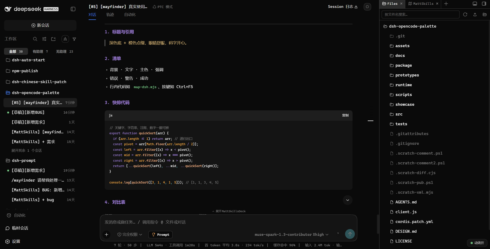
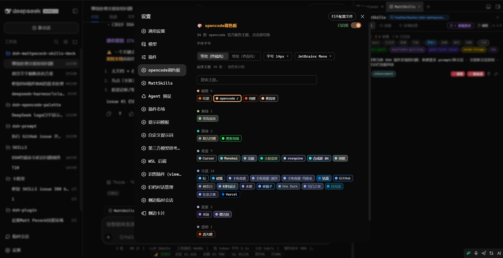
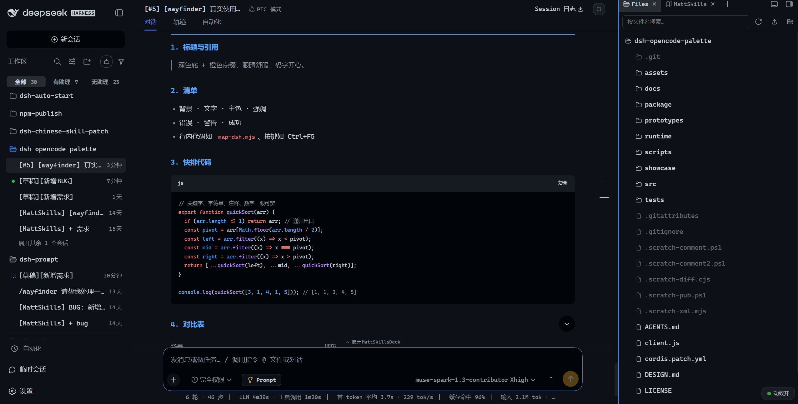
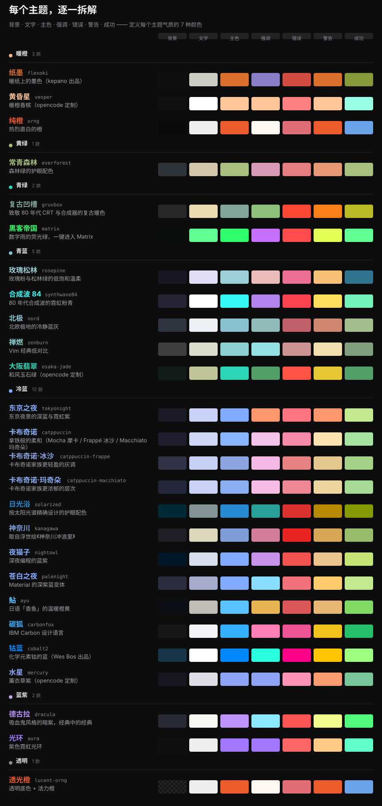

# 🎨 dsh-opencode-palette

**🌐 [中文](README.md) · [English](docs/README.en.md)**

**把 opencode 的经典配色带进 DeepSeek Harness —— 34 款主题，眼睛舒服，码字开心。**

*The complete opencode palette for DeepSeek Harness — 34 official themes. Easier on the eyes, nicer to code in.*

[](LICENSE)
[](https://www.npmjs.com/package/dsh-opencode-palette)
[](https://github.com/anomalyco/opencode)
[]()

## 真实效果

DeepSeek Harness 默认只有一套外观。装上它，整个界面穿上 **opencode 的 34 套官方配色**中的任意一套 —— `tokyonight`、`dracula`、`gruvbox`、`matrix`、`rose-pine`、`catppuccin ×3`、`solarized`、`synthwave84` ……

- 每个颜色都来自 opencode 官方主题 JSON（v1.18.12）——opencode 出厂什么样，这里就是什么样。
- 选过的主题会被记住，重启不丢。

<!-- showcase:start -->
<div align="center">

**👇 装完重启，主界面就是这个样子（opencode 主题）。**



**👇 设置面板：34 款按色系分组，搜一下即切。**



**👇 白天党放心：浅色主题同样完整覆盖。**



</div>

<!-- showcase:end -->

## 一条命令完成安装

需要 **DSH CLI**（DeepSeek Harness 命令行工具）。如果还没有，先安装：

```bash
npm install -g @deepseek-ai/dsh
```

然后把插件装进你的 profile：

```bash
dsh plugin --profile web add dsh-opencode-palette
```

**零配置**：装完重启 DSH（或刷新浏览器页面）即生效，默认启用官方 `opencode` 主题（深黑底 + 橙 / 蓝 / 紫）。

## 30 秒上手

1. 打开 **设置 → 插件 → OpenCode 调色板**（英文界面为 **Settings → Plugins → Opencode Palette**）。
2. 点任意主题色块，界面立即换色。
3. 就这么多——选择自动记住，刷新、重启都不丢。

## 功能详解

### 主题与它们的名字

每个名字背后都有一段来历：



### 34 款官方主题，忠实还原

34 款在设置面板里按色系分组、一搜即切（见上图）。每款主题最核心的 7 种颜色 —— `背景 · 文字 · 主色 · 强调 · 错误 · 警告 · 成功` —— 定义在 `src/themes/`，一览矩阵由 `npm run assets` 生成。

### 顺手好用

- 排印独立于主题：等宽（终端风）或常规（界面风）、字号 11–18 px、5 种代码字体带实时预览（JetBrains Mono、Cascadia Code、Fira Code、SF Mono、Consolas）。
- `system` 一键回到 DSH 原生外观，排印设置保留。
- 面板跟着 DSH 界面语言走（中文 / English），切换即时跟随。

## 升级

```bash
dsh plugin --profile web update dsh-opencode-palette
```

等价方案（幂等重装，会升到 latest 匹配版本）：

```bash
dsh plugin --profile web add dsh-opencode-palette
```

升级后重启 DSH（或刷新浏览器页面）即生效。需要钉回历史版本：`dsh plugin --profile web add dsh-opencode-palette@<版本>`。

<details>
<summary>从 1.4.x 及更早版本升级</summary>

旧版本通过 postinstall 在 `~/.dsh/profiles/web/cordis.patch.yml` 里写过注册块。升级前请删除其中的 `opencode-palette` 注册块（bundle 装配后残留会导致重复注册），再执行上面的 `update` 或 `add`。

</details>

## 作者的其他作品

喜欢这个插件的话，这些可能你也用得上：

- [**dsh-prompt**](https://github.com/FeatherHunter/dsh-prompt) —— 写 Prompt 卡壳的时候，里面有 24 条深度模板，点一下直接进输入框。
- [**dsh-mattpocock-skills-deck**](https://github.com/FeatherHunter/dsh-mattpocock-skills-deck) —— 想让 AI 不只是会聊天？25 个工程技能装好即用，一条安装 Prompt 的事。

## 开发

```bash
npm run sync    # 从 opencode 拉取官方主题 JSON（版本锁定 + 校验和）
npm test        # 31 项测试：34 主题全量审计 + 面板渲染（中/英）
npm run build   # 零依赖打包 → package/ + 动态版 client.js
npm run assets  # 重新生成本 README 中的 SVG 图
```

架构见 [DESIGN.md](DESIGN.md)：数据驱动三层管线，`src/engine/map-dsh.mjs` 是 DSH 映射层唯一真相源。

## 参与贡献

合适的切入点：上游新主题（跑 `npm run sync`）、映射层调优、文案打磨、更多语言翻译。保持引擎纯净（无 DOM），测试全绿即可。

## 许可与归属

MIT © FeatherHunter。主题定义来自 [opencode](https://github.com/anomalyco/opencode)（MIT）及其上游主题项目 —— 见 [THIRD_PARTY_NOTICES](src/themes/THIRD_PARTY_NOTICES.md)。

## 反馈与联系

遇到问题或有改进建议，欢迎直接 [提交 Issue](https://github.com/FeatherHunter/dsh-opencode-palette/issues)；也欢迎扫码添加作者飞书，备注 `dsh-opencode-palette`，一起交流。


