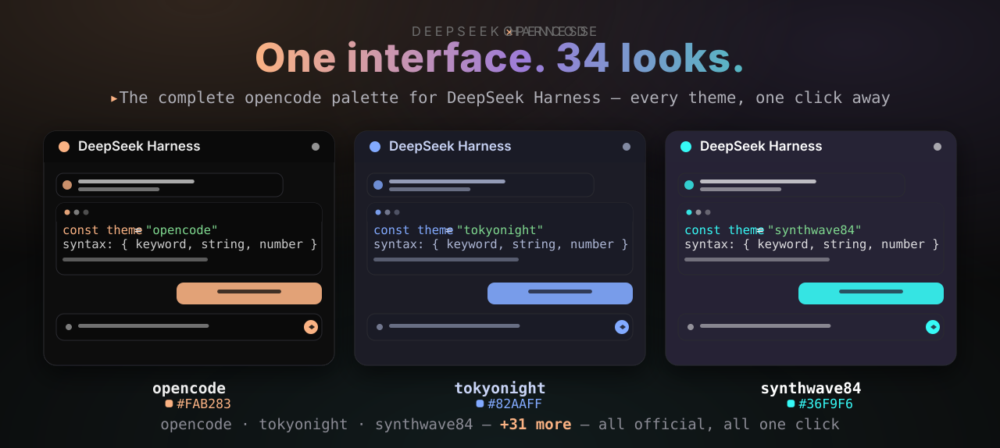
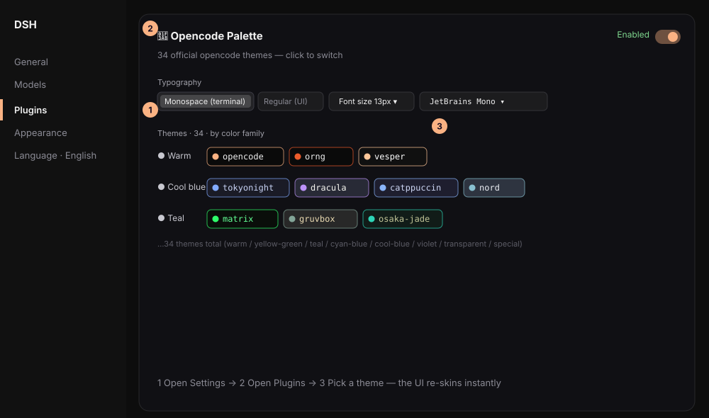
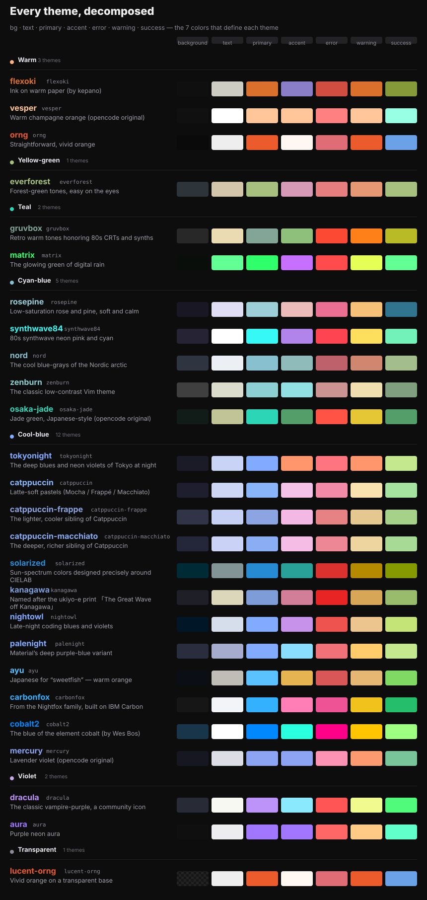
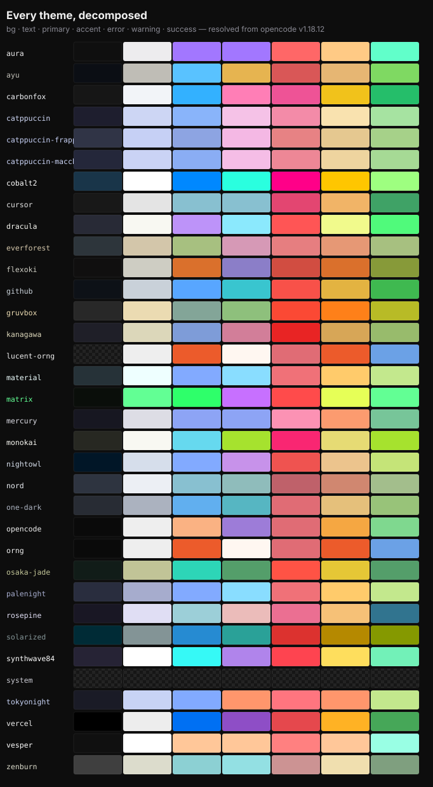
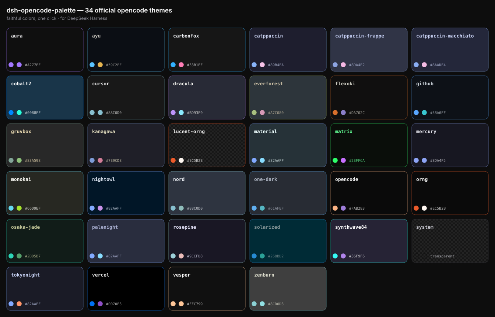

# 🎨 dsh-opencode-palette

**🌐 [中文](../README.md) · [English](README.en.md)**

**The complete opencode palette for DeepSeek Harness — 34 official themes, one click.**

[](../LICENSE)
[](https://github.com/anomalyco/opencode)
[]()



## Install in one command

Requires the **DSH CLI** (DeepSeek Harness command-line tool). If you don't have it yet:

```bash
npm install -g @deepseek-ai/dsh
```

Then install the plugin into your profile:

```bash
dsh plugin --profile web add dsh-opencode-palette
```

That's it: a postinstall hook appends the registration entry to `~/.dsh/profiles/web/cordis.patch.yml` automatically (and removes it on uninstall) — **no manual file editing**. Restart DSH (or refresh the browser page) and the plugin is on, using the official `opencode` theme (deep black with orange / blue / violet).

> **pnpm v10 users**: if the install output shows `Ignored build scripts: dsh-opencode-palette`, pnpm blocked the postinstall so auto-registration didn't run. Run `pnpm approve-builds` once in `~/.dsh/profiles/web` (select dsh-opencode-palette), or add `dsh-opencode-palette: true` to the `allowBuilds` block of that directory's `pnpm-workspace.yaml`, then run `pnpm rebuild dsh-opencode-palette` to finish registration.

## What it does

DeepSeek Harness ships with one look. This plugin lets you dress the whole interface in any of the **34 official opencode themes** — `tokyonight`, `dracula`, `gruvbox`, `matrix`, `rose-pine`, `catppuccin ×3`, `solarized`, `synthwave84` …

- Every color comes from opencode's official theme JSON (v1.18.12) — what opencode ships is what you get.
- One click re-skins everything: backgrounds, buttons, borders, status colors, markdown, and code syntax highlighting.
- Your choice is remembered across restarts.
- The panel speaks your language — it follows the DSH interface language (中文 / English).

## Get started in 30 seconds

**Settings → Plugins → Opencode Palette** (in Chinese: **设置 → 插件 → OpenCode 调色板**):



Click any theme chip — the interface re-skins instantly:


## Features

### 34 themes and the stories behind their names

Every name has a story:



### 34 official themes, faithfully ported

Each theme shows its 7 core colors at a glance — `background · text · primary · accent · error · warning · success`:



All 34 at a glance:



### Typography, independent from the theme

- Body style: monospace (terminal) or regular (UI) — the opencode terminal look or a classic interface look.
- Font size: 11–18 px.
- Code font: 5 presets with live preview (JetBrains Mono, Cascadia Code, Fira Code, SF Mono, Consolas).

### `system` — back to default in one click

Restores DSH's native appearance whenever you want, while keeping your typography settings.

### Persisted per browser

Your theme and typography choices are stored locally and survive refresh and restart.

### Bilingual panel

The panel follows your DSH interface language automatically — switch the language in DSH and the panel follows instantly.

## Development

```bash
npm run sync    # fetch official theme JSONs from opencode (version-locked, checksummed)
npm test        # 20 tests: engine audit of all 34 themes + panel render (zh/en)
npm run build   # zero-dependency bundler -> package/ + dynamic client.js
npm run assets  # regenerate the SVG images in this README
```

Architecture: see [DESIGN.md](../DESIGN.md) — a data-driven three-stage pipeline, with `src/engine/map-dsh.mjs` as the single source of truth for the DSH mapping layer.

## Contributing

Good starting points: new upstream themes (run `npm run sync`), mapping refinements, copy polish, or more locale translations. Keep the engine pure (no DOM) so the tests stay green.

## License & credits

MIT © FeatherHunter. Theme definitions are vendored from [opencode](https://github.com/anomalyco/opencode) (MIT) and its upstream theme projects — see [THIRD_PARTY_NOTICES](../src/themes/THIRD_PARTY_NOTICES.md).