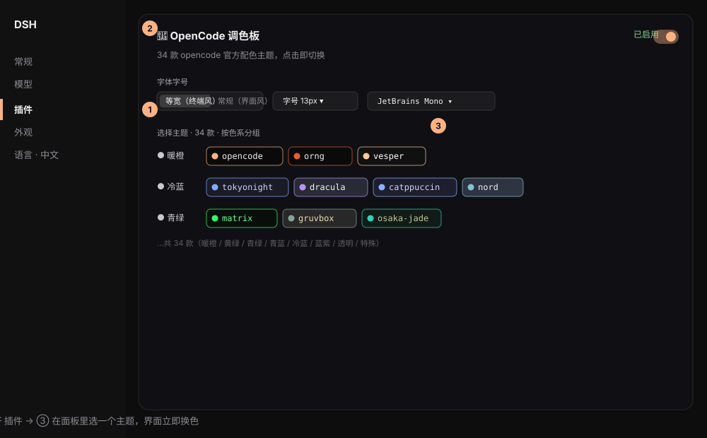
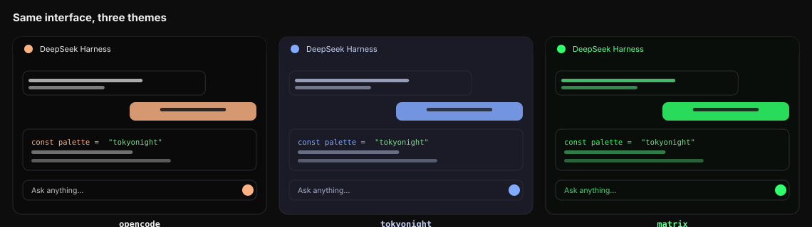

# 🎨 dsh-opencode-palette

**🌐 [English](../README.md) · [中文](README.zh-CN.md)**

**把 opencode 的整套官方调色板搬进 DeepSeek Harness —— 34 款主题，一键切换。**

[](../LICENSE)
[](https://github.com/anomalyco/opencode)
[]()


## 一条命令完成安装

需要 **DSH CLI**（DeepSeek Harness 命令行工具）。如果还没有，先安装：

```bash
npm install -g @deepseek-ai/dsh
```

然后把插件装进你的 profile：

```bash
dsh plugin --profile web add dsh-opencode-palette
```

注册条目（热加载，无需重启）：在 `~/.dsh/profiles/web/cordis.patch.yml` 末尾追加：

```yaml
- insert:
    - id: opencode-palette
      name: 'dsh-opencode-palette'
```

刷新浏览器页面即生效。插件默认启用官方 `opencode` 主题（深黑底 + 橙 / 蓝 / 紫）。

## 它是什么

DeepSeek Harness 默认只有一套外观。装上它之后，你可以让整个界面穿上 **opencode 的 34 套官方配色**中的任意一套 —— `tokyonight`、`dracula`、`gruvbox`、`matrix`、`rose-pine`、`catppuccin ×3`、`solarized`、`synthwave84` ……

- 每个颜色都来自 opencode 官方主题 JSON（v1.18.12）——opencode 出厂什么样，这里就是什么样。
- 点一下，整个界面跟着换：背景、按钮、边框、状态色、markdown、代码高亮全部同步。
- 选过的主题会被记住，重启不丢。
- 面板跟着 DSH 界面语言走（中文 / English）。

## 30 秒上手

**设置 → 插件 → OpenCode 调色板**（英文界面为 **Settings → Plugins → Opencode Palette**）：



点任意主题色块，界面立即换色：



## 功能详解

### 34 款官方主题，忠实还原

下表每个主题都由官方 JSON 解析而来 —— 每行是 7 个核心语义色（`背景 · 文字 · 主色 · 强调 · 错误 · 警告 · 成功`）：


### 排印独立于主题

- 正文样式：等宽（终端风）或常规（界面风）——想要 opencode 的终端观感，还是经典界面观感。
- 字号：11–18 px。
- 代码字体：5 种预设，带实时预览（JetBrains Mono、Cascadia Code、Fira Code、SF Mono、Consolas）。

### `system` —— 一键回到默认

随时恢复 DSH 原生外观，同时保留你的排印设置。

### 按浏览器持久化

主题与排印选择保存在本地，刷新、重启都不丢。

### 面板自动双语

面板跟随 DSH 界面语言 —— 在 DSH 里切换语言，面板即时跟随。

## 开发

```bash
npm run sync    # 从 opencode 拉取官方主题 JSON（版本锁定 + 校验和）
npm test        # 20 项测试：34 主题全量审计 + 面板渲染（中/英）
npm run build   # 零依赖打包 → package/ + 动态版 client.js
npm run assets  # 重新生成本 README 中的 SVG 图
```

架构见 [DESIGN.md](../DESIGN.md)：数据驱动三层管线，`src/engine/map-dsh.mjs` 是 DSH 映射层唯一真相源。

## 参与贡献

合适的切入点：上游新主题（跑 `npm run sync`）、映射层调优、文案打磨、更多语言翻译。保持引擎纯净（无 DOM），测试全绿即可。

## 许可与归属

MIT © FeatherHunter。主题定义来自 [opencode](https://github.com/anomalyco/opencode)（MIT）及其上游主题项目 —— 见 [THIRD_PARTY_NOTICES](../src/themes/THIRD_PARTY_NOTICES.md)。