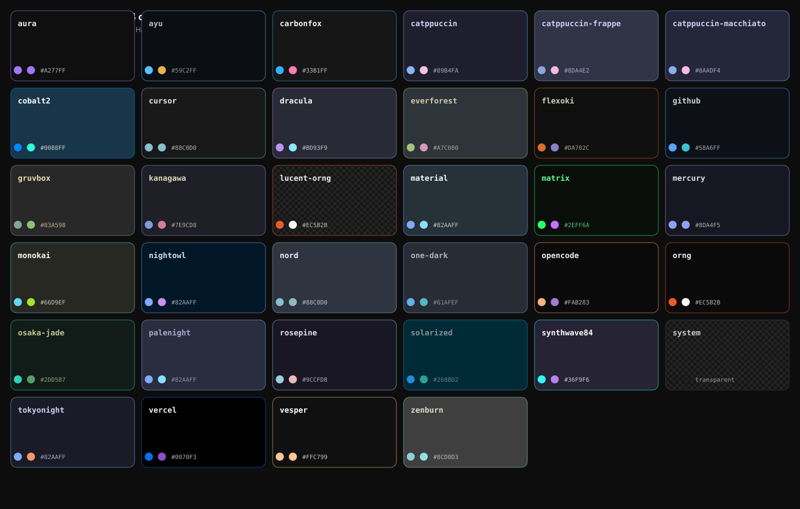
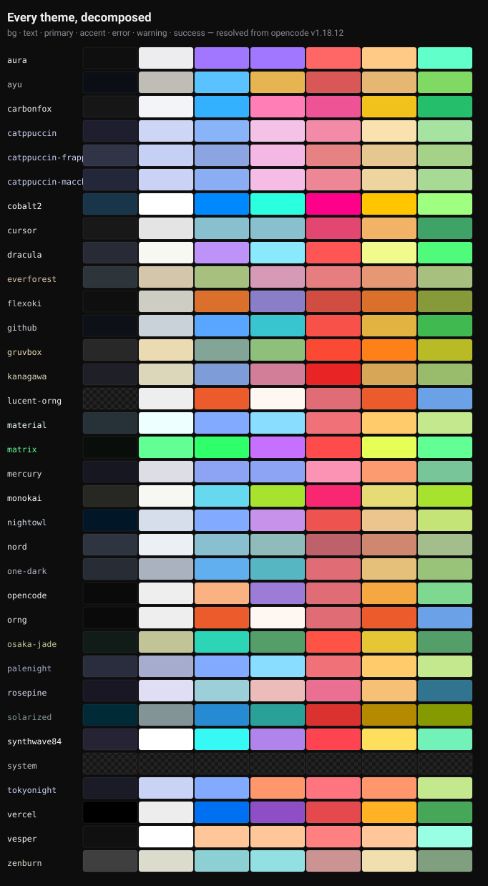

# 🎨 dsh-opencode-palette

**把 opencode 的整套官方调色板搬进 DeepSeek Harness —— 34 款主题，一键切换。**

[](LICENSE)
[](https://github.com/anomalyco/opencode)
[]()

让 **DeepSeek Harness** 拥有 **opencode** 的观感 —— `tokyonight`、`dracula`、`gruvbox`、`matrix`、`rose-pine`、`catppuccin ×3`、`solarized`、`synthwave84` …… **全部 34 款官方主题**，忠实移植，设置面板一键切换。



## 为什么值得用

- 🎯 **34 款 opencode 官方主题** —— 每个颜色都从 opencode 官方主题 JSON（v1.18.12）**解析**而来，不是肉眼仿制。opencode 出厂什么样，这里就是什么样。
- ⚡ **一键切换、即时生效** —— 整个界面重新换肤：背景、表面、边框、按钮、状态色、markdown、代码语法高亮（shiki token）全覆盖。
- 💾 **持久化** —— 刷新、重启都不丢（按浏览器保存于 localStorage）。
- 🅰️ **排印与主题解耦** —— 正文样式（等宽/常规）、字号（11–18px）、5 种代码字体预设，与配色主题互不干扰。
- 🔄 **`system` = 一键还原** —— 恢复 DSH 原生外观，同时保留你的排印设置。
- 🧱 **零运行时依赖 · MIT 协议 · 18 项引擎测试** —— 数据驱动三层管线（主题 JSON → 颜色解析 → DSH 适配），映射层单一真相源。

## 画廊 —— 每个主题拆解



每行是 7 个核心语义色 —— `背景 · 文字 · 主色 · 强调 · 错误 · 警告 · 成功` —— 全部由官方主题 JSON 解析所得。

## 安装

需要 DSH（DeepSeek Harness）Web 客户端。两步、一次性：

```bash
# 1. 安装包到你的 profile
npx --yes @deepseek-ai/dsh plugin --profile web add dsh-opencode-palette

# 2. 在 profile patch 里注册（无需重启，热加载）
#    追加到 ~/.dsh/profiles/web/cordis.patch.yml：
#    - insert:
#        - id: opencode-palette
#          name: 'dsh-opencode-palette'
```

刷新浏览器页面即生效。插件默认启用官方 `opencode` 主题（深黑底 + 橙/蓝/紫）。

## 使用

1. 打开 **设置 → 插件 → Opencode Palette**。
2. 在按色系分组的主题网格中挑选（支持搜索）—— 点击即生效。
3. 网格上方的排印控件：正文样式、字号、代码字体。
4. 右上角开关一键启用/停用整套皮肤。

高级用法：控制台 `window.__opencodePalette` 暴露 `getState`、`setTheme(name)`、`toggle()`、`list()`、`previews()`。

## 从 dsh-opencode-tui-theme 迁移

老用户：删掉 `cordis.patch.yml` 里的旧条目，`dsh plugin --profile web remove dsh-opencode-tui-theme`，再按上文安装本包。你之前选的主题会自动迁移。

## 开发

```bash
npm run sync    # 从 opencode 拉取官方主题 JSON（版本锁定 + 校验和）
npm test        # 18 项引擎测试：34 主题全量解析审计、分组、确定性
npm run build   # 零依赖打包 → package/ + 动态版 client.js
npm run assets  # 重新生成上文 SVG 展示图
```

架构见 [DESIGN.md](DESIGN.md)：数据驱动三层管线，`src/engine/map-dsh.mjs` 是 DSH 映射层唯一真相源。

## 参与贡献

欢迎 PR！切入点：上游新主题（跑 `npm run sync`）、映射层调优、文案打磨。保持引擎纯净（无 DOM），测试全绿即可。

## 许可与归属

MIT © FeatherHunter。

主题定义来自 [opencode](https://github.com/anomalyco/opencode)（MIT）及其上游主题项目 —— 见 [THIRD_PARTY_NOTICES](../src/themes/THIRD_PARTY_NOTICES.md)。

---

**English**: 📖 [README.md](../README.md)