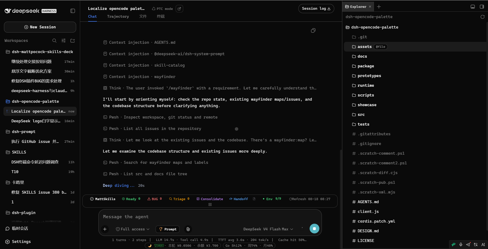
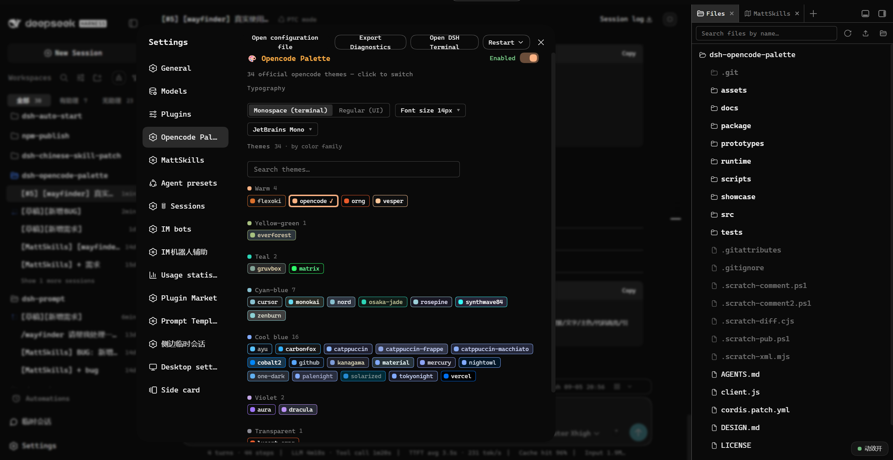
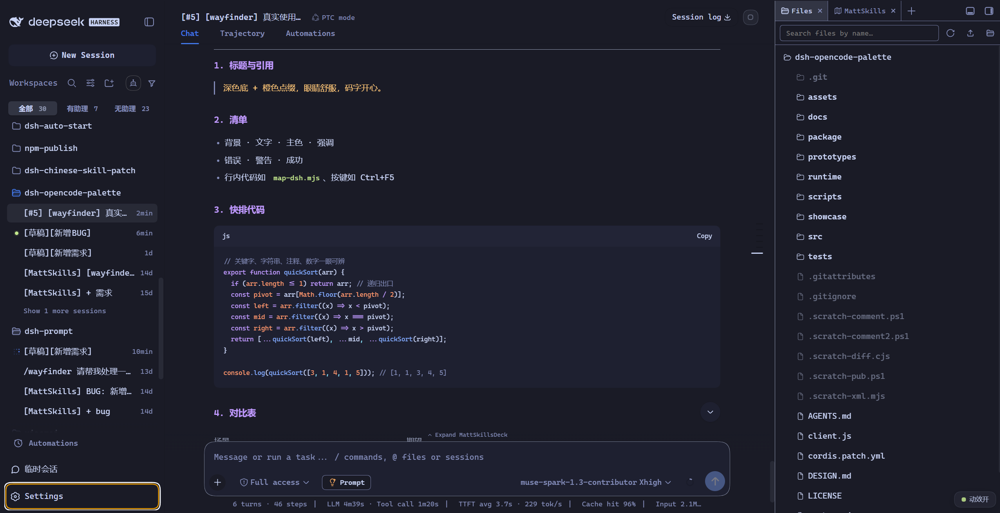

<!-- Prototype fragment: insert into docs/README.en.md after "What it is", before "30 seconds"; review only, do not apply yet. -->

<h2 align="center">SHOWCASE Real Look</h2>

34 official opencode themes — one click re-skins the whole UI, persisted across restarts.

**👇 This is what it looks like after install (opencode theme).**

**👇 Settings: 34 themes grouped by color family, search and switch.**

**👇 More than one skin: star themes like tokyonight included.**

